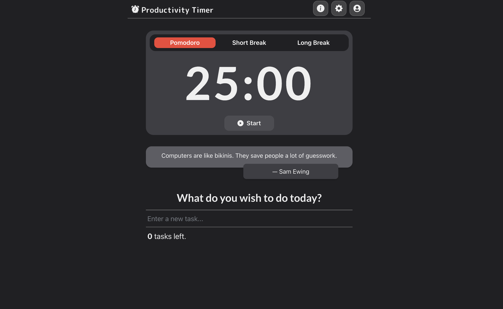

<h1 align="center">
<a href="https://www.productivitytimer.app/">Productivity Timer</a>
   
</h1>
Productivity Timer is a modern pomodoro timer that helps you focus on any task you wish to get done, whether it be studying or coding. Built using Next.js, Chakra UI and Framer Motion, it features extensive user customization, a stunning UI and silky smooth animations.

### Features
Productivity timer stands out from other pomodoro timers because it features
  
- Customizable timer intervals to best suit your working style.  
- Audio notifications at the end of each timer interval.  
- Built in todo list with ability to add subtasks.  
- Clean and intuitive user interface with customizable colors.  
- Built in activity tracker (coming soon!)

